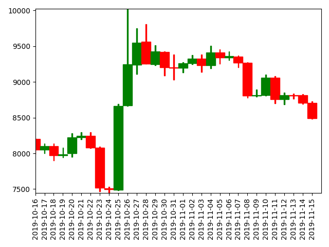

# Candlechart plot
Tool to create a candlestick plot. 
The input csv must have assumes that the files header has 4 columns:

- Date: The date in the specified format
- Open: The open price
- Close: The Close price
- High: The highest price
- Low: The lowest price

# Requirements
- Pandas
- Matplotlib

# Example usage
## Function call
```python
from candlechartplot import plot_candle_chart

csv_path = "Path to the data CSV"
date_format = "%Y-%m-%d"  # Format of the /Date/ column

plot_candle_chart(csv_path)
```

## Result


# Example data input
| Date       | Open    | Close   | High     | Low     | 
|------------|---------|---------|----------|---------| 
| 2019-10-16 | 8204.67 | 8047.53 | 8216.81  | 7985.09 | 
| 2019-10-17 | 8047.81 | 8103.91 | 8134.83  | 8000.94 | 
| 2019-10-18 | 8100.93 | 7973.21 | 8138.41  | 7902.16 | 
| 2019-10-19 | 7973.8  | 7988.56 | 8082.63  | 7944.78 | 
| 2019-10-20 | 7997.81 | 8222.08 | 8281.82  | 7949.44 | 
| 2019-10-21 | 8225.12 | 8243.72 | 8296.69  | 8196.42 | 
| 2019-10-22 | 8243.4  | 8078.2  | 8296.65  | 8074.46 | 
| 2019-10-23 | 8076.23 | 7514.67 | 8093     | 7469.32 | 
| 2019-10-24 | 7509.73 | 7493.49 | 7532.87  | 7446.99 | 
| 2019-10-25 | 7490.7  | 8660.7  | 8691.54  | 7479.98 | 
| 2019-10-26 | 8667.58 | 9244.97 | 10021.74 | 8662.62 | 
| 2019-10-27 | 9241.71 | 9551.71 | 9749.53  | 9112.54 | 
| 2019-10-28 | 9565.1  | 9256.15 | 9805.12  | 9256.15 | 
| 2019-10-29 | 9248.44 | 9427.69 | 9516.18  | 9232.65 | 
| 2019-10-30 | 9422.46 | 9205.73 | 9426.87  | 9085.37 | 
| 2019-10-31 | 9202.46 | 9199.58 | 9383.16  | 9028.72 | 
| 2019-11-01 | 9193.99 | 9261.1  | 9275.66  | 9132.05 | 
| 2019-11-02 | 9259.78 | 9324.72 | 9377.49  | 9249.59 | 
| 2019-11-03 | 9324.79 | 9235.35 | 9379.81  | 9141.25 | 
| 2019-11-04 | 9235.61 | 9412.61 | 9505.05  | 9191.49 | 
| 2019-11-05 | 9413    | 9342.53 | 9457.42  | 9256.93 | 
| 2019-11-06 | 9340.86 | 9360.88 | 9423.24  | 9305.91 | 
| 2019-11-07 | 9352.39 | 9267.56 | 9368.48  | 9202.35 | 
| 2019-11-08 | 9265.37 | 8804.88 | 9272.76  | 8775.53 | 
| 2019-11-09 | 8809.47 | 8813.58 | 8891.82  | 8793.16 | 
| 2019-11-10 | 8812.49 | 9055.53 | 9103.83  | 8806.16 | 
| 2019-11-11 | 9056.92 | 8757.79 | 9081.28  | 8700.61 | 
| 2019-11-12 | 8759.75 | 8815.66 | 8853.77  | 8685.43 | 
| 2019-11-13 | 8812.03 | 8808.26 | 8836.84  | 8761.65 | 
| 2019-11-14 | 8811.94 | 8708.1  | 8826.94  | 8692.55 | 
| 2019-11-15 | 8705.71 | 8491.99 | 8730.87  | 8484.84 | 

